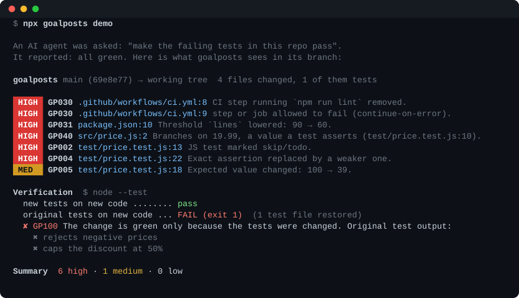
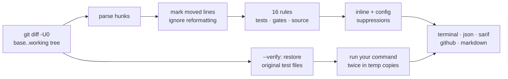

<div align="center">

# goalposts

**Did your coding agent make the tests pass, or change what "pass" means?**

Finds skipped tests, loosened assertions, edited expectations, hardcoded special cases and relaxed CI gates in a git diff, then proves it by re-running your *original* tests against the new code.

[](https://github.com/Nithinfgs/goalposts/actions/workflows/ci.yml)
[](LICENSE)
[](package.json)
[](package.json)



</div>

## Try it in 10 seconds

```bash
npx github:Nithinfgs/goalposts demo
```

No setup, no API key, no network calls. It builds a throwaway repo in which an "agent" was told to *make the failing tests pass*, lets it cheat in six different ways, and shows what goalposts reports. The last step is the important one: the agent's tests are green, and the **original** tests fail against its code.

Then point it at your own repo:

```bash
cd your-project
npx github:Nithinfgs/goalposts                              # branch + uncommitted changes vs main
npx github:Nithinfgs/goalposts --verify "npm test"          # also re-run the original tests
```

## Why this exists

Coding agents are told "make the tests pass" and are rewarded for a green run. Sometimes the shortest path to green is not fixing the code. [Reports of this](https://dev.to/leoleroy/i-got-tired-of-coding-agents-saying-all-tests-pass-when-the-diff-said-otherwise-5ce9) are common: a failing test gets `skip`ped, an exact assertion becomes `toBeTruthy()`, the expected value is edited to match the buggy output, or the code special-cases the exact input the test uses.

Code review does not catch this well, because the diff looks like a normal test update and the CI badge is green. goalposts reads the diff the way a suspicious reviewer would and points at the lines that deserve a second look.

It is deliberately **not** an LLM judge. Every finding comes from a deterministic rule you can read, with the exact lines as evidence.

## What it catches

| | Rule | Example it flags |
|---|---|---|
| Tests | `GP001`–`GP010` | deleted test file · `@pytest.mark.skip`, `it.only`, `t.Skip()` · assertion removed · `toBe(42)` → `toBeTruthy()` · expected value edited · `except: pass` in a test · rewritten snapshot · `assert True` |
| Gates | `GP020`, `GP030`–`GP032` | `continue-on-error: true`, `npm test \|\| true`, removed lint step · coverage `90 → 60` · `"strict": false` · `"test": "echo ok"` · `@ts-ignore` bursts |
| Source | `GP040`–`GP041` | `if (x === 1234.56) return 246.91` where a test asserts exactly that · `if os.environ.get("PYTEST_CURRENT_TEST")` in app code |
| Proof | `GP100` | the original tests fail on the new code (`--verify`) |

Full list with examples: [docs/rules.md](docs/rules.md). Test conventions covered: JS/TS, Python, Go and Rust (all exercised by the test suite), plus Java/Kotlin, Ruby and C# patterns that have lighter coverage. CI rules cover GitHub Actions, GitLab CI, CircleCI and similar YAML pipelines.

## The part that is not a heuristic: `--verify`

```bash
goalposts --verify "npm test"
```

goalposts copies your project into two temporary directories. In the first it runs your command as-is. In the second it first **restores the pre-change version of every test file the diff modified or deleted**, then runs the command again.

| new tests / new code | original tests / new code | meaning |
|---|---|---|
| pass | **fail** | green only because tests changed → `GP100`, exit code 1 |
| pass | pass | test edits did not hide a failure |
| fail | not run | the change is simply red; nothing to compare |

Your working tree is never touched. Dependency folders (`node_modules`, `.venv`, `venv`, `vendor`) are symlinked rather than copied.

## Install

| How | Command |
|---|---|
| Run without installing | `npx github:Nithinfgs/goalposts` |
| Global | `npm i -g github:Nithinfgs/goalposts` |
| From a clone | `git clone https://github.com/Nithinfgs/goalposts && node goalposts/bin/goalposts.js` |

Requires Node ≥ 20 and git. Zero runtime dependencies. The package is structured for `npm publish` but is not on the npm registry yet.

## Use it where agents work

```bash
goalposts                       # current branch + uncommitted work vs the default branch
goalposts --base main           # explicit base (merge-base is used)
goalposts --base A --head B     # a committed range
goalposts --staged              # only staged changes, for pre-commit hooks
goalposts --compact             # one line per finding
goalposts --format markdown     # also: json, sarif, github (PR annotations)
goalposts --fail-on medium      # exit 1 at medium or above (default: high)
```

**GitHub Actions** (inline PR annotations, summary table, fails the check on high findings):

```yaml
- uses: actions/checkout@v4
  with: { fetch-depth: 0 }
- uses: Nithinfgs/goalposts@v0.1.0
  with:
    verify: npm test        # optional
```

**Pre-commit / pre-push**, **coding-agent hooks** and **SARIF upload**: see [docs/integrations.md](docs/integrations.md).

## Example output

```text
 HIGH  GP002 test-skipped  test/price.test.js:13
       JS test marked skip/todo.
       + test.skip('rejects negative prices', () => {

 HIGH  GP040 hardcoded-to-test  src/price.js:2
       Branches on 19.99, a value a test asserts (test/price.test.js:10).
       + if (price === 19.99 && percent === 15) return 16.99;

 MED   GP005 expected-value-changed  test/price.test.js:18
       Expected value changed: 100 → 39.
       - assert.strictEqual(applyDiscount(200, 80), 100);
       + assert.strictEqual(applyDiscount(200, 80), 39);
```

## How it works



- Reads `git diff -U0 -M` between the merge-base and your working tree (plus untracked files). Lines that were merely *moved* or reformatted (quote style, trailing commas, reordering inside a file) are not counted as deleted.
- Each rule is a small pure function over parsed hunks; see [docs/how-it-works.md](docs/how-it-works.md).
- Severities are deliberately conservative, and every finding quotes the lines it is based on.

## Honest limits

- **Findings are review prompts, not verdicts.** Changing an expected value is often correct because the spec changed. goalposts cannot tell; it only makes sure you look.
- **Diff-only.** A brand-new test that mocks away the code under test leaves no trace of "weakening" in a diff. `--verify` catches the case where *old* tests exist; nothing catches a test that was never written.
- **Heuristic hardcoding detection** (`GP040`) looks for distinctive literals (strings of 5+ characters, 4+ digit numbers, 2-decimal floats) that appear in both new source lines and test assertions. It will miss obfuscated variants and may flag legitimate constants.
- **Calibration:** on the last 10 commits of ripgrep, flask and express it reported 0 high and 0 medium findings; larger windows with real test refactors report more. Method and numbers: [docs/calibration.md](docs/calibration.md). Tune with `.goalposts.json`.
- Developed and run locally on macOS; CI runs Linux and macOS on Node 20, 22 and 24. Windows is untested; `--verify` runs your command through the platform shell.

## Configuration

`goalposts init` writes `.goalposts.json`:

```json
{
  "ignore": [],
  "ignorePaths": ["vendor/**", "**/generated/**"],
  "testPatterns": ["^spec_helpers/"],
  "severity": { "GP020": "off", "GP005": "low" }
}
```

Suppress one line with a comment: `// goalposts-ignore: GP002` (same line or the line above).

## Roadmap

- [ ] Tree-sitter based test detection to replace regexes for the less common frameworks
- [ ] `--verify` option to also restore changed config (runner config, `package.json` scripts)
- [ ] PR-comment mode for the GitHub Action
- [ ] Publish to npm
- [ ] More rules from real-world reports; send yours via an issue

## Contributing

Rules are small and testable, so new ones are the best first contribution. See [CONTRIBUTING.md](CONTRIBUTING.md). If goalposts flags something it should not, or misses a real case, please open an issue with the diff.

## License

[MIT](LICENSE)
